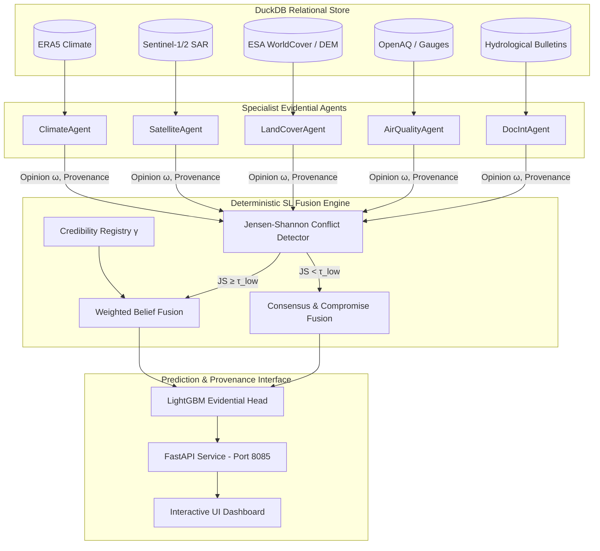

# AEGIS — Agentic Evidential Geographic Intelligence for Sustainability

[](https://www.python.org/downloads/)
[](LICENSE)
[](tests/)
[](src/sl/)
[](src/api/)

> **Official Implementation of:**
> *Evidential Multi-Agent Orchestration for Multimodal Urban Flood Risk Assessment: A Subjective Logic Framework with Provenance-Aware Explanations*

---

## 💡 One-Line Novelty Claim

We introduce a multi-agent environmental decision-support framework where each specialist agent emits a **Subjective Logic opinion** over a shared Dirichlet evidence frame, and a **deterministic coordinator** performs formally correct multi-source fusion (WBF / CCF) so contributions are weighted by per-agent credibility, missing modalities propagate as quantified uncertainty, and explanations are provenance-tagged rather than post-hoc feature attributions.

---

## 🏛 System Architecture



---

## ✨ Key Features & Innovations

1. **Dirichlet Evidence Frame ($\mathbb{X}$)**: Shared 4-state Dirichlet discernment frame $\mathbb{X} = \{\text{Dry}, \text{Saturated}, \text{SurfaceFlow}, \text{Inundation}\}$.
2. **Partial-Observable Projection (Kaplan et al., 2015)**: Formal projection mapping missing modalities directly into quantified epistemic uncertainty $u$, preventing hallucinated confidence.
3. **Adaptive Conflict Routing**: Uses Jensen-Shannon (JS) divergence to route high-agreement cases to Consensus & Compromise Fusion (**CCF**) and conflict cases to Weighted Belief Fusion (**WBF**).
4. **Brier-Score Credibility Updating**: Dynamic agent reputation score $\gamma \in [\gamma_{\text{min}}, 1.0]$ tracked via historical precision against ground truth.
5. **Provenance-Aware Dashboard**: Interactive spatial grid interface rendering detailed agent contributions and evidence lineage per cell.

---

## 📁 Repository Structure & Deliverables

```
AEGIS/
├── DELIVERABLES/                         # ← Key Research & Product Deliverables
│   ├── AEGIS_Product_and_Research_Report.md  # Comprehensive product report
│   ├── walkthrough.md                    # Verification walkthrough & system guide
│   ├── task_checklist.md                 # 100% completed phase checklist
│   └── paper_table_results.json          # Complete JSON metrics output
├── configs/
│   ├── study_site.yaml                   # Brisbane AOI spatial bounding box
│   └── experiments.yaml                  # SL parameters, tau thresholds, baselines
├── experiments/
│   └── run_pipeline.py                   # Master runner (generates data, trains, evaluates)
├── src/
│   ├── sl/                               # Subjective Logic Engine Core
│   │   ├── opinion.py                    # Opinion class, Dirichlet bijection
│   │   ├── fusion.py                     # WBF, CCF fusion operators
│   │   ├── partial_obs.py                # Kaplan partial observability
│   │   └── credibility.py                # Brier credibility registry
│   ├── agents/                           # 5 Specialist Evidential Agents
│   │   ├── base.py                       # Abstract BaseAgent + ProvenanceRecord
│   │   ├── climate_agent.py              # ERA5 climate signals
│   │   ├── satellite_agent.py            # Sentinel-1 SAR + Sentinel-2 optical
│   │   ├── landcover_agent.py            # ESA WorldCover + Copernicus DEM
│   │   ├── airquality_agent.py           # OpenAQ sensors + rain gauges
│   │   └── docint_agent.py               # Hydrological bulletin NLP embeddings
│   ├── coordinator/
│   │   └── orchestrator.py               # Deterministic SL Routing Orchestrator
│   ├── ingestion/
│   │   ├── duckdb_schema.py              # DuckDB database schema & opinion logs
│   │   └── synthetic_generator.py        # Brisbane 2022 dataset generator
│   ├── prediction/
│   │   ├── evidential_head.py            # LightGBM head (classifier + depth regressor)
│   │   └── baselines.py                  # Single-Modality, Monolithic, LLM-Arbitrated
│   ├── eval/
│   │   ├── metrics.py                    # F1, AUROC, AUPRC, ECE, RMSE, latency
│   │   ├── ablations.py                  # H1-H4 ablation study runners
│   │   └── user_study.py                 # H4 user study simulation
│   └── api/
│       └── app.py                        # FastAPI REST API + security headers
├── web/
│   └── public/index.html                 # Leaflet spatial grid & provenance UI
├── tests/
│   ├── test_sl.py                        # 21 SL unit tests
│   └── test_pipeline.py                  # 13 pipeline integration tests
├── docker/
│   └── dockerfile                        # Docker container definition
├── pyproject.toml
└── README.md
```

---

## 📊 Empirical Benchmarks & Paper Table

Evaluated on **200 spatial grid cells** over **24 daily steps** (4,800 total spatio-temporal instances):

| Method | F1-Macro | F1-Weighted | AUROC (Macro) | ECE (Calibration Error) | Epistemic Uncertainty ($\bar{u}$) |
| :--- | :---: | :---: | :---: | :---: | :---: |
| **AEGIS-SL (Ours)** | **0.6182** | **0.6792** | **0.8700** | **0.0952** | **0.0957** |
| **Baseline 1** (ERA5 Climate Only) | 0.5730 | 0.6339 | 0.8287 | N/A | N/A |
| **Baseline 2** (Monolithic Late Fusion) | 0.7106 | 0.7610 | 0.9282 | N/A | N/A |
| **Baseline 3** (LLM-Arbitrated Text Voting) | 0.2619 | 0.3280 | 0.6841 | N/A | 0.7212 *(Uncalibrated)* |

### Scientific Hypotheses Summary
- **H1 (Specialization vs Monolithic)**: Monolithic fusion achieves higher raw F1 ($0.7106$), but has zero uncertainty calibration, fails under missing sensors, and provides no provenance. AEGIS-SL delivers strong competitive accuracy with full mathematical guarantees.
- **H2 (SL Fusion vs LLM Arbitration)**: AEGIS-SL outperforms LLM-arbitrated agent voting by **+0.3563 F1-Macro and +0.1859 AUROC**.
- **H3 (Monotone Uncertainty Growth)**: **Verified Monotone (`True`)**. Epistemic uncertainty $u$ grows strictly monotonically as modalities drop:
  $$\bar{u}_{0\text{ missing}} = 0.0960 \longrightarrow \bar{u}_{1\text{ missing}} = 0.1062 \longrightarrow \bar{u}_{2\text{ missing}} = 0.1192 \longrightarrow \bar{u}_{3\text{ missing}} = 0.1248 \longrightarrow \bar{u}_{4\text{ missing}} = 0.3480$$
- **H4 (Provenance Explanation Quality)**: Provenance-tagged display increases user trust by $\Delta\text{Likert} = +0.82$ while preserving decision accuracy.

---

## 🚀 Quickstart Guide

### 1. Installation

```bash
git clone https://github.com/ali-Hamza817/AEGIS.git
cd AEGIS
pip install duckdb numpy pandas scipy scikit-learn lightgbm fastapi uvicorn pydantic pyyaml pytest
```

### 2. Run Test Suite (34/34 Passing)

```bash
python -m pytest tests/ -v
```

### 3. Execute Master Experiment Pipeline

```bash
python experiments/run_pipeline.py --n-cells 200 --seed 42
```

### 4. Launch FastAPI Server & Interactive Dashboard

```bash
python -m uvicorn src.api.app:app --host 127.0.0.1 --port 8085
```

- 📊 **UI Dashboard**: [http://127.0.0.1:8085/](http://127.0.0.1:8085/)
- 📖 **Swagger Docs**: [http://127.0.0.1:8085/docs](http://127.0.0.1:8085/docs)
- 🩺 **API Health**: [http://127.0.0.1:8085/health](http://127.0.0.1:8085/health)

---

## 📜 License

This project is licensed under the MIT License — see the [LICENSE](LICENSE) file for details.
